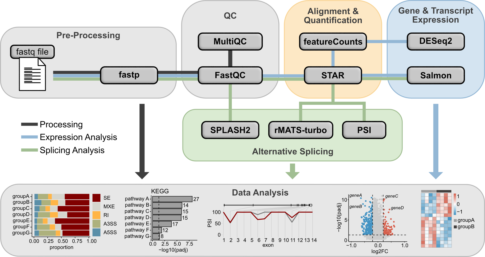

# RNAseq Pipeline



This repository contains an RNAseq analysis pipeline built with [Snakemake](https://snakemake.readthedocs.io/en/stable/). The pipeline is modular and reproducible, integrating multiple analysis steps—from read preprocessing, differential gene expression, and alternative splicing analysis, to exon-level PSI calculation. It is designed to run either in a GUIX or Conda environment.

This pipeline (including the downstream data analysis) is a work-in-progress. It serves as a personal project designed to continuously enhance my skills in bioinformatics, computational biology, and data analysis. As part of its ongoing development, new features will be added and existing components refined or restructured based on testing and integration of further scripts and tools.

## Pipeline Overview
The pipeline includes the following key steps:
- **Preprocessing**:
Adapter trimming and quality filtering using [fastp](https://github.com/OpenGene/fastp) ([Chen et al., 2018](https://pubmed.ncbi.nlm.nih.gov/30423086/)).
- **Quality Control**:
Generation and summarization of quality reports using [FastQC](https://www.bioinformatics.babraham.ac.uk/projects/fastqc/) and [MultiQC](https://github.com/MultiQC/MultiQC).
- **Alignment**:
Alignment of reads to the reference genome using [STAR](https://github.com/alexdobin/STAR) ([Dobin et al., 2012](https://pmc.ncbi.nlm.nih.gov/articles/PMC3530905/)) in two-pass mode.
- **Gene-level Read Counting**:
Generation of gene-level counts for differential gene expression (DGE) analysis using [featureCounts](https://subread.sourceforge.net/featureCounts.html) ([Liao et al., 2013](https://academic.oup.com/bioinformatics/article/30/7/923/232889)) (part of the subread package).
- **Transcript Quantification**:
Quantification of transcript abundances using [Salmon](https://combine-lab.github.io/salmon/getting_started/).
- **Alternative Splicing Analysis**:
Alternative splicing (AS) analysis using [rMATS-turbo](https://github.com/Xinglab/rmats-turbo) and [SPLASH2](https://github.com/refresh-bio/SPLASH/wiki)([Chaung et al., 2023](https://www.cell.com/cell/fulltext/S0092-8674(23)01179-0), [Kokot et al., 2024](https://www.cell.com/cell/fulltext/S0092-8674(23)01179-0).
- **PSI Calculation**:
Calculation of exon-level Percent Spliced In (PSI) values. The Python scripts used to calculate exon-level Percent Spliced In (PSI) values are adapted from [Schafer et al. 2015](https://currentprotocols.onlinelibrary.wiley.com/doi/full/10.1002/0471142905.hg1116s87) and originally available at https://github.com/MIAOKUI/PSI. **Note**: These scripts are released under the GNU General Public License v3 and are not provided as part of this repository. For integration into this pipeline, see [Prerequisites](#prerequisites).


## Prerequisites
1. Before running the pipeline, **STAR and Salmon indexes** must be available. Indexes can either be:
    1. **Generated as part of the pipeline** (recommended).
    2. **Reused from pre-built versions** by setting the appropriate configuration flags in the [config.yml](./config.yml) file.
    3. **Built externally** using the following command examples: 
\
        **STAR Index**:

        ```bash
        STAR --runThreadN 16 --runMode genomeGenerate \
        --genomeDir path/to/output/index \
        --genomeFastaFiles path/to/genome/annotation.fa \
        --sjdbGTFfile path/to/gene/annotation.gtf \
        --sjdbOverhang 149 \ # general rule: read length -1
        ```

        **Salmon Index**:

        ```bash
        salmon index -t path/to/transcriptome.fa.gz -i path/to/output
        ```

**2. Snakemake Profile**:
A [Snakemake profile](https://snakemake.readthedocs.io/en/stable/executing/cli.html) should be configured for the computing environment (this pipeline assumes a [Slurm profile](https://github.com/snakemake-profiles)).

**3. GUIX shell**: 
If using the GUIX shell approach, [rMATS-turbo](https://github.com/Xinglab/rmats-turbo) must be installed and the path to the executable set in the [config.yml](./config.yml) file.

**4. Reduced GFF Annotation**:
For exon-level PSI calculations a reduced GFF annotation file is required (e.g. generated using [dexseq_prepare_annotation.py](https://bioconductor.org/packages/release/bioc/vignettes/DEXSeq/inst/doc/DEXSeq.html#24_preparing_the_annotation)).

**5. PSI scripts**:
PSI calculation scripts are provided at https://github.com/MIAOKUI/PSI. Originally written in Python 2, these scripts require updates to Python 3 for incorporation into this pipeline. The following code snippets illustrate additional required changes:

| script             | original code                                  | new code                        |
|--------------------|------------------------------------------------|---------------------------------|
| exclusion_count.py | `fout = open(outFile+".exclusion","w")`         | `fout = open(outFile,"w")`        |
| psi_calculation.py | `fout = open(basename + '.psi', 'wt')`          | `fout = open(basename, 'wt')`     |

**5. SPLASH2**:
Installation of [SPLASH2](https://github.com/refresh-bio/SPLASH/wiki/Installation) is required and the path to the executable needs to be defined in the config.yml file.

## Tools & Dependencies
The pipeline’s software environment is managed using Conda or GUIX. Full dependency details are available in the environment.yml or manifest.scm file, respectively. Key tools (and their versions) include:
- Python 3.10.7
- Snakemake 7.7.0
- fastp 0.23.2
- MultiQC 1.14
- STAR 2.7.8a
- samtools 1.19
- rMATS-turbo 4.3.0
- subread 2.0.3 (featureCounts)
- Salmon 1.10.1
- bedtools 2.30.0
- R-base 4.4.2 & Bioconductor DEXSeq 1.52
- HTSeq 2.0.2
- pysam 0.20.0


## Installation
**1. Clone the Repository**:
```bash
git clone https://github.com/your_username/rnaseq_pipeline.git
cd rnaseq_pipeline
```


**2.1 Set Up the Conda Environment**:
Make sure Conda is installed, then run:

```bash
conda env create -f environment.yml
conda activate rnaseq_pipeline
```

**2.2 Set up the Guix Shell**
Make sure Guix is installed, then run the following to load the Guix environment:

```bash
guix shell -m manifest.scm
```

Both 2.1 and 2.2 are not necessary when using the provided run_pipeline_guix.sh or run_pipeline_conda.sh script, which loads the appropriate environment automatically.

**3. Prepare Input Data**:
Configure the paths input FASTQ files, STAR index, Salmon index, and annotation files by editing the [config.yml](./config.yml).


## Running the Pipeline
For execution on a Slurm-based HPC cluster, use either [run_pipeline_guix.sh](./run_pipeline_guix.sh) or [run_pipeline_conda.sh](./run_pipeline_conda.sh). The script leverages the Snakemake profile (see [cluster.yml](./cluster.yml) for resource configurations) and submits jobs via Slurm. For example:

``` bash
./run_pipeline_guix.sh
```

The command executed by this script is:

```bash
guix shell -m manifest.scm -- \
    snakemake -s pipeline.smk \
        --profile slurm \
        --cluster-config cluster.yml \
        --cluster "sbatch --mem={cluster.mem} --time={cluster.time} --cpus-per-task={cluster.cpus-per-task} {cluster.log}" \
        -j 100 > progress.log 2>&1

```

All progress and log information is directed to progress.log.

## Pipeline Structure
- pipeline.smk:
Main Snakemake workflow file that defines all pipeline rules.
- cluster.yml:
Cluster resource configuration for job submission (Slurm).
- config.yml:
User-configurable parameters including file paths and tool settings.
- environment.yml:
Conda environment specification listing all required tools and dependencies.
- run_pipeline_*.sh:
Shell script for submitting the pipeline (should be run from the project root on a login node, best with using [tmux](https://github.com/tmux/tmux/wiki) for example).
- PSI_scripts:
Folder containing Python scripts for PSI calculation and related analyses. The scripts are from [Schafer et al. 2015](https://currentprotocols.onlinelibrary.wiley.com/doi/full/10.1002/0471142905.hg1116s87) (https://github.com/MIAOKUI/PSI)
- R_scripts:
Folder containing R scripts for downstream data analysis, e.g. for generating exon-level PSI plots or differential gene expression analysis using DESeq2 ([Love et al., 2014](https://genomebiology.biomedcentral.com/articles/10.1186/s13059-014-0550-8))

## Output
The pipeline produces multiple output files:
- **Preprocessed Reads**:
Trimmed FASTQ files generated by fastp.
- **Quality Reports**:
Individual FastQC reports and a combined MultiQC report.
- **Alignment Files**:
STAR alignment outputs.
- **Gene Counts**:
Gene-level read count files from featureCounts.
- **Transcript Quantification**:
Salmon quantification outputs.
- **Alternative Splicing**:
Splicing analysis results from rMATS-turbo.
- **PSI Values**:
Exon-level PSI values the python scripts from https://github.com/MIAOKUI/PSI.
- **SPLASH2**:
Unsupervised and reference-free k-mers of anchor and target sequences, e.g. for downstream splicing analysis (see: https://github.com/refresh-bio/SPLASH)

## Troubleshooting
- Resource Issues:
If jobs fail due to memory errors, adjust resource settings in cluster.yml or your Snakemake rules.
- Input Paths:
Ensure that all file paths in config.yml are correct and accessible.
- Environment Problems:
Verify that the Conda environment is activated and that all dependencies are correctly installed.

## Planned Improvements & Ideas
- add RSeQC for quality and statistics
- generation of a final report (including statistics, figures, tables, ...)
- improve and expand existing R scripts (e.g include enrichment analysis (GO, KEGG, Wikipathways, GSEA))
- additional R scripts for downstream analysis and result visualization (e.g. Differential Transcript Usage using [DRIMSeq](https://pmc.ncbi.nlm.nih.gov/articles/PMC5200948/))
- add example output figures

## License
This project is licensed under the GNU General Public License v3.0. See the LICENSE file for details.

## References
Chen S, Zhou Y, Chen Y, Gu J. fastp: an ultra-fast all-in-one FASTQ preprocessor. Bioinformatics. 2018 Sep 1;34(17):i884-i890. doi: 10.1093/bioinformatics/bty560. PMID: 30423086; PMCID: PMC6129281.

Dobin A, Davis CA, Schlesinger F, Drenkow J, Zaleski C, Jha S, Batut P, Chaisson M, Gingeras TR. STAR: ultrafast universal RNA-seq aligner. Bioinformatics. 2013 Jan 1;29(1):15-21. doi: 10.1093/bioinformatics/bts635. Epub 2012 Oct 25. PMID: 23104886; PMCID: PMC3530905.

Liao Y, Smyth GK, Shi W. featureCounts: an efficient general purpose program for assigning sequence reads to genomic features. Bioinformatics. 2014 Apr 1;30(7):923-30. doi: 10.1093/bioinformatics/btt656. Epub 2013 Nov 13. PMID: 24227677.

Nowicka M, Robinson MD. DRIMSeq: a Dirichlet-multinomial framework for multivariate count outcomes in genomics. F1000Res. 2016 Jun 13;5:1356. doi: 10.12688/f1000research.8900.2. PMID: 28105305; PMCID: PMC5200948.